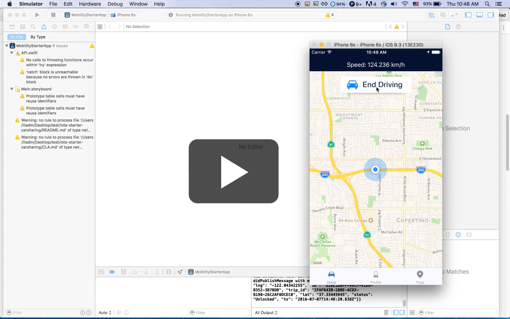

# IoT for Automotive Starter Carsharing mobile app


## Overview
The IoT for Automotive Starter Experience uses the **Context Mapping** and **Driver Behavior** services that are available on **IBM Bluemix** to help you to quickly build a smart car-sharing automotive solution. The IoT for Automotive Starter Experience Carsharing application consists of a set of source code and instructions for an iOS mobile app and a server app.

The Carsharing mobile app provides sample source code for interacting with the Carsharing server app. The server app provides the back-end car-sharing service. For more information about deploying the server app of the Carsharing starter experience, see
[ibm-watson-iot/iota-starter-server](https://github.com/ibm-watson-iot/iota-starter-server).

Using the iOS Carsharing mobile app, you can search for available cars that are nearby, reserve a car, unlock the car, and then start driving the car. While you drive the car, the service tracks your location and also records your driving behavior. When you reach your driving destination, you can view information about each trip that you took in the car and you can also view your driving behavior score.

## Prerequisites

Before you try to deploy the mobile app, ensure that the following prerequisites are met:

- The sample source code for the IoT for Automotive Starter Experience Carsharing mobile app is only supported for use with an official Apple iOS device.
- The sample source code is also supported only with officially licensed Apple development tools that are customized and distributed under the terms and conditions of your licensed Apple iOS Developer Program or your licensed Apple iOS Enterprise Program.
- Apple Xcode 7.3 integrated development environment (IDE) and [CocoaPods](https://cocoapods.org/) must be installed onto the computer that you plan to clone the source repository onto.

## Building the starter mobile app

To deploy the starter experience Carsharing mobile app, do the following steps:

1. Open a Terminal session and install CocoaPods by using the following command:   
```$ sudo gem install cocoapods```    
2. Clone the IBM Carsharing source code repository for the sample mobile app by using the following git command:  
```$ git clone https://github.com/ibm-watson-iot/iota-starter-carsharing```   
3. Go to your Carsharing project folder, and then enter the following commands:   
```$ pod install```  
```$ open MobileStarterApp.xcworkspace```

4. Set a URL of an instance of **IoT for Automotive Starter Server App** to the _connectedAppURL_ variable in **API.swift** file.

5.  At the upper left of the Xcode UI, click **Run**.

6. Optional: If you would like to be notified about certain events, for example, severe weather at the pickup location, enable push notifications, as outlined in the next procedure.

To view a video recording that demonstrates how to complete the steps to deploy the mobile app, click play:

[](https://www.youtube.com/watch?v=9O5uoPsn0LA "Instructions")  

### Setting up push notifications

You can optionally enable Apple Push Notifications (APN) to warn users about severe weather conditions that might be occurring at the drop off time and location of the car reservation.

To enable push notifications, complete the following steps:

1. Register an app ID enabled APNs on the [Apple Developer](https://developer.apple.com/) portal.

2. Create an APN development SSL certificate.

3. Create an APN development provisioning profile.

4. Setting up APNs on the Bluemix Push Notifications Dashboard binded to your server application.

5. Connect your iOS mobile device to your Apple Mac.

6. Change the bundle ID of the Xcode project to your app ID.

7. In Xcode, select your iOS device as the build target and press **Build and run**.

8. On the mobile app, tap **Specify Server**.

9. To start the camera function, tap the QR code image.

10. Open your server app with a  PC browser at the URL https://&lt;your-app-route&gt;.mybluemix.net/, and then scroll down to display a QR code.

11. Read the QR code for the mobile app.

For more information, see [Push notifications](https://console.ng.bluemix.net/docs/services/mobilepush/t_push_provider_ios.html).

### Mobile Client Access service

The Carsharing mobile app provides a simple demonstration of the Mobile Client Access service. The app logs in with the user name and password by using the  Mobile Client Access for custom authentication.

* [CustomAuthDelegate.swift](MobileStarterApp/CustomAuthDelegate.swift) onAuthenticationChallengeReceived()  
Call `submitAuthenticationChallengeAnswer()` with the user name and password that you entered in the login alert.

* [QRCodeReaderViewController.swift](MobileStarterApp/QRCodeReaderViewController.swift) configureVideoCapture()  
Set whether to use custom authentication in okAction.

* [API.swift](MobileStarterApp/API.swift) doInitialize()  
Initialize the Mobile Client Access client SDK.

For more information, see [Configuring the Mobile Client Access client SDK for iOS](https://console.ng.bluemix.net/docs/services/mobileaccess/custom-auth-ios-swift-sdk.html).

You also need to add and configure Mobile Client Access for custom authentication on the IoT for Automotive Starter Experience Carsharing app server. For more information, see [IoT for Automotive Starter app]( https://github.com/ibm-watson-iot/iota-starter-server).

## Reporting defects
To report a bug in the Carsharing app, go to the  [Issues](https://github.com/ibm-watson-iot/iota-starter-carsharing/issues) section.

## Privacy notice
The IoT for Automotive Starter Experience Carsharing app on IBM Bluemix stores all of the driving history that is obtained while you use the mobile app.


## Useful links

- [IBM IoT for Automotive](http://www.ibm.com/internet-of-things/iot-industry/iot-automotive)
- [IBM Watson Internet of Things](http://www.ibm.com/internet-of-things/)  
- [IBM Watson IoT Platform](http://www.ibm.com/internet-of-things/iot-solutions/watson-iot-platform/)   
- [IBM Watson IoT Platform Developers Community](https://developer.ibm.com/iotplatform/)
- [IBM Bluemix](https://bluemix.net/)  
- [IBM Bluemix documentation](https://www.ng.bluemix.net/docs/)  
- [IBM Bluemix developers community](http://developer.ibm.com/bluemix)  
